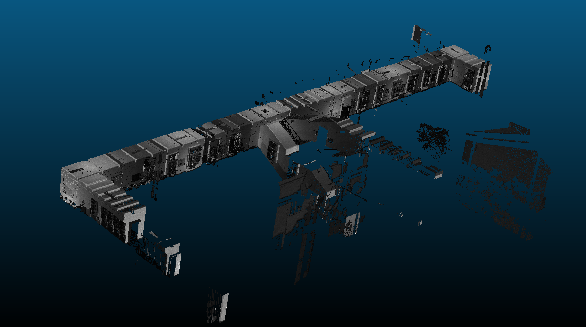

# Depth Correction


LiDAR measurements correction models trained in a self-supervised manner on real data from diverse environments.
Models exploit multiple point cloud measurements of the same scene from different view-points in
order to reduce the bias based on the consistency of the constructed map.

- **self-supervised training** pipeline based on the point cloud map consistency information.

- depth correction models **remove LiDAR measurements bias** related to measuring
scene surfaces with high incidence angle.

- more **accurate maps** created from corrected consistent measurements.

- **reduction of the localization drift** in SLAM scenarios.


## Datasets

For models evauation we utilize and provide training pipeline on
the following publicly available datasets:

- [ASL laser](https://projects.asl.ethz.ch/datasets/doku.php?id=laserregistration:laserregistration),
- [Semantic KITTI](http://www.semantic-kitti.org/dataset.html),
- [Newer College](https://ori-drs.github.io/newer-college-dataset/).
- [KITTI-360](https://www.cvlibs.net/datasets/kitti-360/)

In addition, we provide our dataset that contains point cloud data captured in indorr environment
with precise localization and ground truth mapping information.
Download the dataset and put it in the `./data` folder.
It exhibits the following structure:

```bash
depth_correction
└── 22-11-24-kn_e2_corridor
    ├── bags
    ├── maps
    │   ├── blk
    │   ├── e57
    │   ├── npz
    │   ├── pcd
    │   ├── ptx
    │   └── vtk
    └── sequences
        ├── slam_2022-11-24-15-28-59
        │   ├── calibration
        │   ├── ouster_points
        │   └── poses
        └── slam_2022-11-24-15-39-08
            ├── calibration
            ├── ouster_points
            └── poses
```


There the `map` folder containes ground truth scans captured with
the [Leica BLK360](https://leica-geosystems.com/products/laser-scanners/scanners/blk360) scanner.
Two "stop-and-go" data sqeuences are provided of a robot with mounter
Ouster [OS1-128](https://ouster.com/blog/introducing-the-os-1-128-lidar-sensor/)
lidar moving in the same environment.
Individual scans from static robot positions are recorded in
`ouster_points` folders as `*.npz` or `*.bin` file formats.
Ground truth robot poses are obtained using
[norlab-icp-mapper](https://github.com/norlab-ulaval/norlab_icp_mapper_ros)
lidar SLAM with alignment to prerecorded ground truth map.
Additionally robot poses are recorded with the help of
[Leica Tracker](https://leica-geosystems.com/products/laser-tracker-systems).

To explore the data, simply run (assuming the [data](https://github.com/tpet/data) package is built):

```bash
python -m data.depth_correction
```

## Installation

Please, follow the installation instructions, provided in
[docs/install.md](https://github.com/RuslanAgishev/depth_correction/blob/main/docs/install.md)
