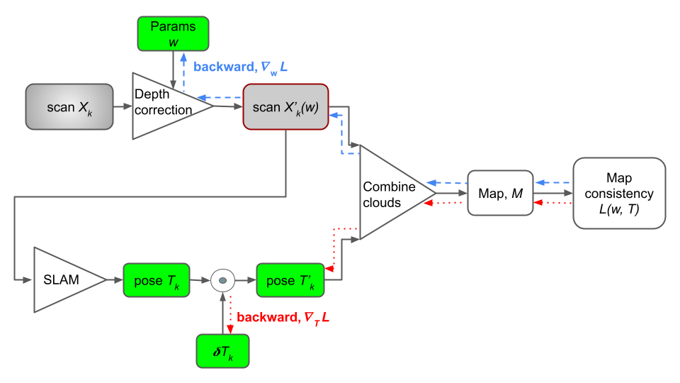

# Depth Correction

Point cloud maps acquired using consumer-level lidar still
suffer from **bias related to measuring scene surfaces with high incidence angle**.
A learnable method that refines lidar measurements based on the local shape of the measured surface.
In particular, we introduce two novel point cloud map consistency losses, which facilitate self-supervised learning on real data of lidar depth correction models.
Complementary to the removal of the bias from lidar measurements, we demonstrate that the depth correction models help to reduce localization drift.

[comment]: <> ()

#### Topics

- `input` [[sensor_msgs/PointCloud2](http://docs.ros.org/en/noetic/api/sensor_msgs/html/msg/PointCloud2.html)]: Input point cloud to subscribe to.
- `output` [sensor_msgs/PointCloud2]: Published point cloud topic.

#### Parameters

- `model_class`: Class name from module depth_correction.model.
- `model_args`: Model constructor positional arguments.
- `model_kwargs`: Model constructor key-value arguments.
- `model_state_dict`: Path to the model state dict.
- `device`: Device to run tensor operations on: cpu or cuda.
- `max_age`: Maximum age of input point cloud to correct.
- `nn_k`: Nearest neighbor count.
- `nn_r`: Nearest neighbor radius.
- `shadow_neighborhood_angle`: Shadow neighborhood angle.
- `shadow_angle_bounds`: Shadow angle bounds for neighbors.
- `eigenvalue_bounds`: Eigenvalue bounds for correcting depth.

## Training Pipeline



LiDAR measurements correction models trained in a self-supervised manner on real data from diverse environments.
Models exploit multiple point cloud measurements of the same scene from different view-points in
order to reduce the bias based on the consistency of the constructed map.

- **self-supervised training** pipeline based on the point cloud map consistency information.

- depth correction models **remove LiDAR measurements bias** related to measuring
scene surfaces with high incidence angle.

- more **accurate maps** created from corrected consistent measurements.

- **reduction of the localization drift** in SLAM scenarios.


## Installation

Please, follow the installation instructions, provided in
[docs/install.md](https://github.com/RuslanAgishev/depth_correction/blob/main/docs/install.md)

## Usage

Running depth correction node to refine point clouds used futher as input to
[SLAM](https://github.com/tpet/norlab_icp_mapper_ros):

```bash
roslaunch depth_correction slam_eval.launch depth_correction:=true model_class:=ScaledPolynomial model_state_dict:=/path/to/model_state_dict.pth play:=true bag:=/path/to/bag/file/name.bag rviz:=true
```

Launch training of depth correction models:
```bash
roslaunch depth_correction train_demo.launch rviz:=true
```


## Datasets

For models evaluation we utilize and provide training pipeline on
the following publicly available datasets:

- [ASL laser](https://projects.asl.ethz.ch/datasets/doku.php?id=laserregistration:laserregistration),
- [Semantic KITTI](http://www.semantic-kitti.org/dataset.html),
- [Newer College](https://ori-drs.github.io/newer-college-dataset/).
- [KITTI-360](https://www.cvlibs.net/datasets/kitti-360/)
- [FEE Corridor](http://ptak.felk.cvut.cz/vras/data/fee_corridor/)

In addition, we provide our dataset (`FEE Corridor`) that contains point cloud data captured in indorr environment
with precise localization and ground truth mapping information.
Download the dataset from
[http://ptak.felk.cvut.cz/vras/data/fee_corridor/fee_corridor.zip](http://ptak.felk.cvut.cz/vras/data/fee_corridor/fee_corridor.zip)
and put it to the `./data` folder (50 Gb).
It exhibits the following structure:

<!-- `tree -L 4 -d fee_corridor` -->
```bash
fee_corridor
├── bags
├── maps
│   ├── blk
│   ├── e57
│   ├── npz
│   ├── pcd
│   ├── ptx
│   └── vtk
└── sequences
    ├── seq1
    │   ├── calibration
    │   ├── ouster_points
    │   ├── poses
    │   └── static_ouster_points
    └── seq2
        ├── calibration
        ├── ouster_points
        ├── poses
        └── static_ouster_points
```
 

There the `map` folder containes ground truth scans captured with
the [Leica BLK360](https://leica-geosystems.com/products/laser-scanners/scanners/blk360) scanner.
Two "stop-and-go" data sqeuences are provided of a robot with mounter
Ouster [OS1-128](https://ouster.com/blog/introducing-the-os-1-128-lidar-sensor/)
lidar moving in the same environment.
Individual scans from static robot positions are recorded in
`static_ouster_points` folders as `*.npz` or `*.bin` file formats.
Ground truth robot poses are obtained using
[norlab-icp-mapper](https://github.com/norlab-ulaval/norlab_icp_mapper_ros)
lidar SLAM with alignment to prerecorded ground truth map.
Additionally robot poses are recorded with the help of
[Leica Tracker](https://leica-geosystems.com/products/laser-tracker-systems).

To explore the data, simply run:

```bash
python -m depth_correction.datasets.fee_corridor
```


## Optimization Example

Point cloud scans correction with ICP-like point to plane distance as loss function.

```python
# import necessary libraries
import torch
from depth_correction.datasets.fee_corridor import Dataset, dataset_names
from depth_correction.depth_cloud import DepthCloud
from depth_correction.model import ScaledPolynomial
from depth_correction.preproc import filtered_cloud
from depth_correction.config import Config
from depth_correction.loss import point_to_plane_dist

# in this example we use collected indoor dataset
ds = Dataset(name=dataset_names[0])

# setup data and optimization parameters
cfg = Config()
cfg.lr = 0.001

# define model for scans correction: depth correction term in the example d' = w * gamma^4
model = ScaledPolynomial(w=[0.0], exponent=[4])
optimizer = torch.optim.Adam(model.parameters(), lr=cfg.lr)

# the two neighboring scans are used
points1_struct, pose1 = ds[0]
points2_struct, pose2 = ds[1]

# construct depth cloud objects from points
cloud1 = DepthCloud.from_structured_array(points1_struct)
cloud2 = DepthCloud.from_structured_array(points2_struct)

# apply grid and depth filters to clouds
cloud1 = filtered_cloud(cloud1, cfg)
cloud2 = filtered_cloud(cloud2, cfg)

# transform point clouds to the same world coordinate frame
cloud1 = cloud1.transform(torch.as_tensor(pose1))
cloud2 = cloud2.transform(torch.as_tensor(pose2))

# compute cloud features necessary for optimization (like normals and incidence angles)
cloud1.update_all(r=cfg.nn_r)
cloud2.update_all(r=cfg.nn_r)

# run optimization loop
for i in range(cfg.n_opt_iters):
    cloud1_corr = model(cloud1)
    cloud2_corr = model(cloud2)
    
    cloud1_corr.update_points()
    cloud2_corr.update_points()

    loss = point_to_plane_dist(clouds=[cloud1_corr, cloud2_corr])

    optimizer.zero_grad()
    loss.backward()
    optimizer.step()
    
    print(model)
    print(loss)
```


## Training of the Models

Evaluation of baselines.

Compute map consistency metrics on raw data (not corrected with the models):
```bash
python -m depth_correction.main --dataset fee_corridor --min-depth 1.0 --max-depth 25.0 --grid-res 0.2 --nn-r 0.4 -- eval_loss_baselines
```

Estimate localization accuracy with
[norlab_icp_mapper](https://github.com/norlab-ulaval/norlab_icp_mapper)
using ground truth from a dataset:

```bash
python -m depth_correction.main --dataset fee_corridor --min-depth 1.0 --max-depth 25.0 --grid-res 0.2 --nn-r 0.4 --ros-master-port 12311 --rviz true -- eval_slam_baselines
```

Training of depth correction models and evaluation of them on map consistency and localization accuracy (whole pipeline):
```bash
python -m depth_correction.main --dataset fee_corridor --min-depth 1.0 --max-depth 25.0 --grid-res 0.2 --nn-r 0.4 -- train_and_eval_all
```
